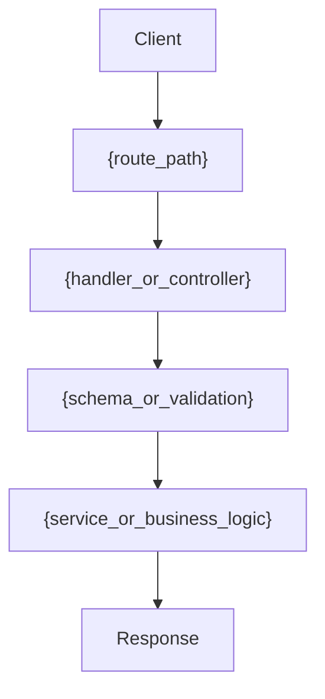

# API Context: {api_slug}

> This template is a support aid. Runtime skills remain the source of truth for required behavior and sections.

## At a Glance

| Field | Value |
| --- | --- |
| Display Name | `{human_readable_name}` |
| Domain/Area | `{domain_or_feature_area}` |
| Primary Route | `{primary_route}` |
| Main Entrypoint | `{main_entrypoint}` |
| Auth Required | `{yes_no_unknown}` |
| Cross-Cutting Impact | `{true_false_unknown}` |
| Last Verified | `{YYYY-MM-DD}` |

**Purpose:** `{one_or_two_sentence_purpose}`

**What to inspect first:** `{first_file_or_section_to_read}`

## API Identity

| Field | Value |
| --- | --- |
| API Slug | `{api_slug}` |
| Display Name | `{human_readable_name}` |
| Domain/Area | `{domain_or_feature_area}` |
| Owner/Module | `{owner_or_module}` |

## Endpoint Map

| Method | Route | Entrypoint | Purpose |
| --- | --- | --- | --- |
| `{http_method}` | `{route_path}` | `{router_or_handler_entrypoint}` | `{short_purpose}` |

## Workflow

Notes:
- Happy path: `{happy_path_summary}`
- Important branches: `{important_branches_or_none}`

## Relevant Files

| Role | File | Notes |
| --- | --- | --- |
| Route | `{path_to_route}` | `{route_notes}` |
| Handler | `{path_to_handler}` | `{handler_notes}` |
| Service | `{path_to_service}` | `{service_notes}` |
| Schema/DTO | `{path_to_schema_or_dto}` | `{schema_notes}` |
| Tests | `{path_to_tests}` | `{test_notes}` |

## Request Contract

| Part | Shape / Rules |
| --- | --- |
| Path Params | `{path_params_or_none}` |
| Query Params | `{query_params_or_none}` |
| Headers | `{required_headers_or_none}` |
| Body | `{body_shape_or_reference}` |
| Validation | `{validation_rules}` |

## Response Contract

| Case | Status | Shape / Notes |
| --- | --- | --- |
| Success | `{success_status}` | `{success_shape}` |
| Error | `{error_status}` | `{error_shape_or_reason}` |
| Compatibility | `{n/a}` | `{compatibility_notes}` |

## Auth and Permissions

| Topic | Behavior |
| --- | --- |
| Auth Mechanism | `{auth_mechanism}` |
| Permission Checks | `{permission_rules}` |
| Failure Behavior | `{auth_error_behavior}` |

## Dependencies and External Services

| Dependency | Type | Used For | Risk |
| --- | --- | --- | --- |
| `{internal_service_or_module}` | Internal | `{purpose}` | `{risk_or_none}` |
| `{external_service_or_provider}` | External | `{purpose}` | `{risk_or_none}` |
| `{shared_utility_or_middleware}` | Shared | `{purpose}` | `{risk_or_none}` |

## Known Constraints and Risks

| Risk / Constraint | Impact | Mitigation / Note |
| --- | --- | --- |
| `{constraint_or_risk_1}` | `{impact}` | `{mitigation_or_note}` |
| `{constraint_or_risk_2}` | `{impact}` | `{mitigation_or_note}` |

## Verification Commands

| Command | Purpose | Last Result |
| --- | --- | --- |
| `{command_1}` | `{what_it_checks}` | `{pass_fail_not_run}` |
| `{command_2}` | `{what_it_checks}` | `{pass_fail_not_run}` |

## Open Improvement Opportunities

| Opportunity | Why It Matters | Priority |
| --- | --- | --- |
| `{improvement_idea_1}` | `{reason}` | `{low_medium_high}` |
| `{improvement_idea_2}` | `{reason}` | `{low_medium_high}` |

## Decision Log

### [{YYYY-MM-DD}] Initial Capture
- `{why_this_api_file_exists}`

## Last Verified

| Field | Value |
| --- | --- |
| Date | `{YYYY-MM-DD}` |
| Verified By | `{agent_or_owner}` |
| Notes | `{verification_summary}` |
